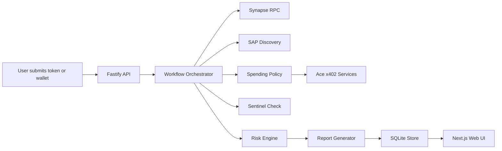

# AgentIntel Broker

AgentIntel Broker is an autonomous Solana intelligence service. It accepts a token mint or wallet address, fetches on-chain evidence, discovers external tools, buys paid data services when there is a recorded reason, stores payment receipts, runs Sentinel checks, scores risk, and returns a structured report.

The product is intentionally small: one economic agent, one workflow, one audit trail.

## What It Does

- Analyzes Solana token mints and wallet addresses.
- Fetches Solana evidence through Synapse RPC-compatible JSON-RPC calls.
- Discovers SAP tools and records discovery results.
- Calls Ace Data Cloud services through x402 payment flows.
- Stores payment receipts, spending events, Sentinel checks, and reports.
- Generates JSON and Markdown intelligence reports.
- Shows a premium Nebula dashboard-style web interface.
- Enforces spending limits, repeated-target limits, and required reasons for paid calls.

## Architecture



## Projects

- `agent/`: TypeScript backend, adapters, workflow, risk engine, reports, SQLite persistence.
- `web/`: Next.js Nebula landing/dashboard UI.
- `docs/`: architecture, integration, operations, and anti-wash documentation.

## Quickstart

Requirements:

- Node.js 24+
- npm

Install dependencies:

```powershell
npm run install:all
```

Start the backend:

```powershell
npm run dev:backend
```

Start the dashboard in another terminal:

```powershell
npm run dev:frontend
```

Open:

- Web UI: [http://localhost:3000](http://localhost:3000)
- API health: [http://localhost:3001/api/health](http://localhost:3001/api/health)

## Useful Commands

```powershell
npm run build
npm run test
npm run db:reset
npm run demo:seed
npm run demo:workflow
npm run sap:check
npm --prefix agent run sap:discovery
npm run ace:check
npm run sentinel:check
```

## Web UI

The web interface is a polished dark glassmorphism command center for the agent, with:

- sticky glass navigation;
- live agent status and balances;
- new analysis workflow submission;
- workflow runs, run details, reports, payment receipts, integration status, and readiness checks;
- a mock market telemetry preview in the hero area.

## API

Core endpoints:

- `GET /api/health`
- `GET /api/readiness`
- `GET /api/integration-status`
- `POST /api/analyze`
- `POST /api/scheduled-demo-run`
- `GET /api/dashboard/summary`
- `GET /api/dashboard/runs`
- `GET /api/dashboard/runs/:id`
- `GET /api/dashboard/receipts`
- `GET /api/dashboard/reports`
- `GET /api/payments/:runId`
- `GET /api/reports/:id`
- `GET /api/balances`
- `GET /api/audit/:runId`

## Mock And Real Mode

Mock mode is useful for local development and repeatable demos. Real mode requires credentials, funded payment wallets or escrow, and service-specific configuration.

Backend mode switches live in `agent/.env`:

```text
SAP_MOCK_MODE=true
SYNAPSE_MOCK_MODE=true
ACE_MOCK_MODE=true
SENTINEL_MOCK_MODE=true
```

When mock mode is enabled, the UI labels mock receipts and integration status clearly.

## Environment

Copy the backend example env:

```powershell
Copy-Item agent\.env.example agent\.env
```

Important groups:

- SAP: `SAP_AGENT_ID`, `SAP_PRIVATE_KEY`, `SAP_REGISTRY_ENDPOINT`, `SAP_MOCK_MODE`
- Synapse RPC: `SYNAPSE_RPC_URL`, `SYNAPSE_API_KEY`, `SYNAPSE_MOCK_MODE`
- Ace x402: `ACE_API_KEY`, `ACE_X402_FACILITATOR_URL`, `ACE_X402_PRIVATE_KEY`, `ACE_X402_ORDER_ID_*`, `ACE_MOCK_MODE`
- Sentinel: `SENTINEL_ENDPOINT`, `SENTINEL_DEPOSITOR_WALLET`, `SENTINEL_MOCK_MODE`
- App controls: `DATABASE_URL`, `API_AUTH_TOKEN`, `CORS_ORIGIN`, `MAX_DAILY_SPEND_USDC`, `MAX_SPEND_PER_RUN_USDC`, `MAX_TOOL_CALLS_PER_RUN`, `PORT`

Frontend config lives in `web/.env.local` for local Next.js development:

```text
NEXT_PUBLIC_API_BASE_URL=http://localhost:3001
NEXT_PUBLIC_API_AUTH_TOKEN=
```

## Operational Notes

- Paid calls require a non-empty `reason_for_call`.
- Spending policy blocks runaway spend, repeated identical targets, too many paid calls, and agent-to-itself payment loops.
- Receipts are attached to workflow runs and can be reviewed in the dashboard.
- Audit bundles are exported as JSON from `GET /api/audit/:runId`.
- Wallet balances are read from public RPCs through `GET /api/balances`; private keys are never returned by the API.
- Secrets are loaded from environment variables and are not stored in the database.

## Documentation

- `docs/ARCHITECTURE.md`
- `docs/INTEGRATION_GUIDE.md`
- `docs/ANTI_WASH_POLICY.md`
- `docs/DEMO_SCRIPT.md`
- `docs/SAP_REGISTRATION.md`

## Production Hardening

Before hosting for real users, add:

- managed secrets;
- persistent database migrations;
- durable job queue;
- stronger authentication and per-user authorization;
- hosted log storage with redaction;
- monitoring and alerting;
- backup and recovery plan.
