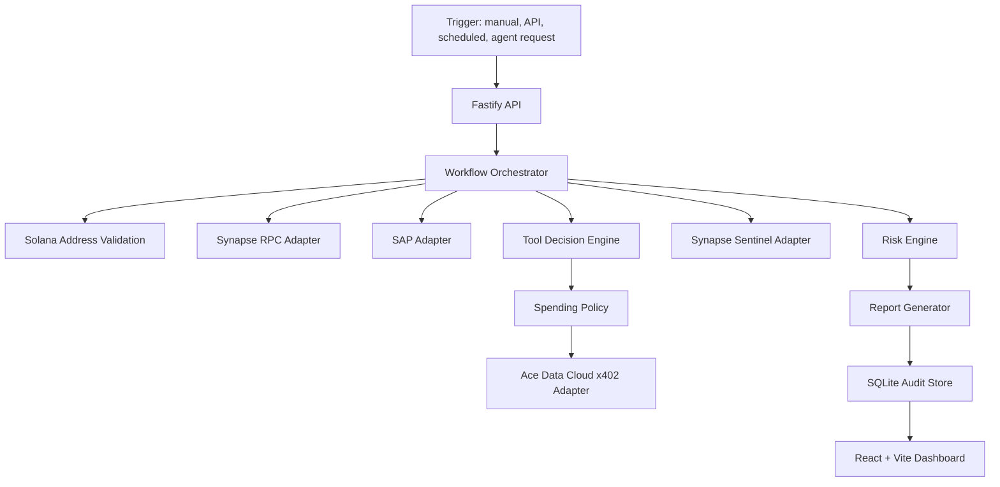

# Architecture

AgentIntel Broker is one autonomous economic agent. It accepts a Solana token mint or wallet address, runs a bounded workflow, buys tools only when there is a recorded reason, and stores an operational audit trail.

## System Components



## Backend

Location: `agent/`

Runtime stack:

- TypeScript
- Node.js 24+
- Fastify
- Drizzle ORM with SQLite through Node `node:sqlite`
- Zod for typed env validation
- pino for structured logging

Important modules:

- `src/config/env.ts`: typed environment loader.
- `src/db/schema.ts`: audit and workflow tables.
- `src/server/app.ts`: Fastify server composition.
- `src/server/requestControls.ts`: security headers, optional bearer auth, CORS allowlist, and in-memory rate limit.
- `src/workflow/workflowOrchestrator.ts`: autonomous workflow.
- `src/workflow/toolDecisionEngine.ts`: deterministic paid-tool selection.
- `src/payments/spendingPolicy.ts`: budget and anti-wash controls.
- `src/risk/riskEngine.ts`: explainable scoring.
- `src/reports/reportGenerator.ts`: JSON and Markdown report creation.
- `src/product/productReadiness.ts`: local and production readiness gate.

## Dashboard

Location: `web/`

Runtime stack:

- React
- Vite
- TypeScript
- Fetch API
- Simple CSS

Pages:

- Agent Status
- New Analysis
- Workflow Runs
- Run Detail
- Payment Receipts
- Reports
- Integration Status
- Operations

## Data Flow

1. `POST /api/analyze` receives target type, address, trigger type, and optional requester.
2. The orchestrator creates a `workflow_runs` row.
3. Address validation ensures the target is base58 and decodes to a 32-byte Solana public key.
4. Synapse RPC adapter fetches on-chain evidence.
5. SAP adapter discovers tools and stores discovery records.
6. Tool Decision Engine chooses Ace services:
   - Tokens always buy AI classification.
   - Tokens buy web search when metadata hints exist.
   - Tokens buy entity enrichment when metadata has a link or project name.
   - Wallets always buy AI classification.
   - Wallets buy enrichment/search when interaction context supports it.
7. Spending Policy checks budget, call counts, repeated target limits, self-payment loops, run attachment, and reason-for-call.
8. Ace adapter executes service calls and returns payment receipt data.
9. Receipts, Ace calls, and spending events are stored.
10. Sentinel adapter is called once.
11. Risk Engine generates score, verdict, reasons, signals, and confidence.
12. Report Generator creates JSON and Markdown reports.
13. Workflow is marked completed or failed.
14. Dashboard reads the stored audit trail.
15. Operations readiness evaluates whether the workflow is local-only, production-ready, or blocked.

## Storage Model

SQLite tables:

- `workflow_runs`
- `tool_discoveries`
- `ace_service_calls`
- `payment_receipts`
- `sentinel_checks`
- `reports`
- `spending_events`

The database stores workflow audit records, not secrets. API keys and private keys are environment variables.

## Integration Boundaries

SAP:

- `agent/src/sap/sapClient.ts`
- Mock mode provides deterministic discovery records.
- Real mode uses the official SAP SDK boundary in `agent/src/sap/sapOfficialSdk.ts` for registration/status/discovery.
- Discovery reads capability indexes first, then falls back to the SAP `x402` protocol index when capability discovery is empty. It does not fabricate matches.

Synapse RPC:

- `agent/src/synapse/synapseRpcClient.ts`
- Mock mode returns deterministic evidence.
- Real mode implements standard Solana JSON-RPC calls where possible.

Ace x402:

- `agent/src/ace/aceX402Client.ts`
- Mock mode returns mock x402 receipts.
- Real mode validates config, uses `x402-fetch` for payment signing, and stores only real payment responses as non-mock receipts.

Sentinel:

- `agent/src/sentinel/sentinelClient.ts`
- Mock mode returns mock Sentinel evidence payloads.
- Real mode calls the public Synapse Sentinel SAP x402 gateway at `https://agent.sentinel.oobeprotocol.ai/tools/:name`.
- Successful real execution requires a funded SAP escrow and `x-sap-depositor`; payment-required responses are surfaced as errors rather than stored as successful execution. The gateway expects tool arguments wrapped as `{ "input": ... }`.

## Mock Mode

Mock mode is enabled by default:

```text
SAP_MOCK_MODE=true
SYNAPSE_MOCK_MODE=true
ACE_MOCK_MODE=true
SENTINEL_MOCK_MODE=true
```

Mock outputs are useful for local development and workflow testing. They are not real payments or real external-service execution.

## Real Mode Readiness

Use:

```text
GET /api/integration-status
GET /api/readiness
```

It returns whether each integration is `mock`, `configured`, or `missing_config`.

`configured` means required environment variables are present only. It does not claim successful mainnet execution.

## Product Hardening

The current product layer includes:

- Optional bearer-token auth with `API_AUTH_TOKEN`.
- CORS allowlist with `CORS_ORIGIN`.
- Per-IP in-memory rate limiting with `RATE_LIMIT_WINDOW_MS` and `RATE_LIMIT_MAX_REQUESTS`.
- Security headers on API responses.
- Product readiness gate at `GET /api/readiness`.
- Stable SHA-256 hash in audit bundles from `GET /api/audit/:runId`.

These controls make the local product safer to demo or host lightly. A serious hosted deployment should still add durable job queues, managed secrets, persistent logs, backups, and a migration workflow.
